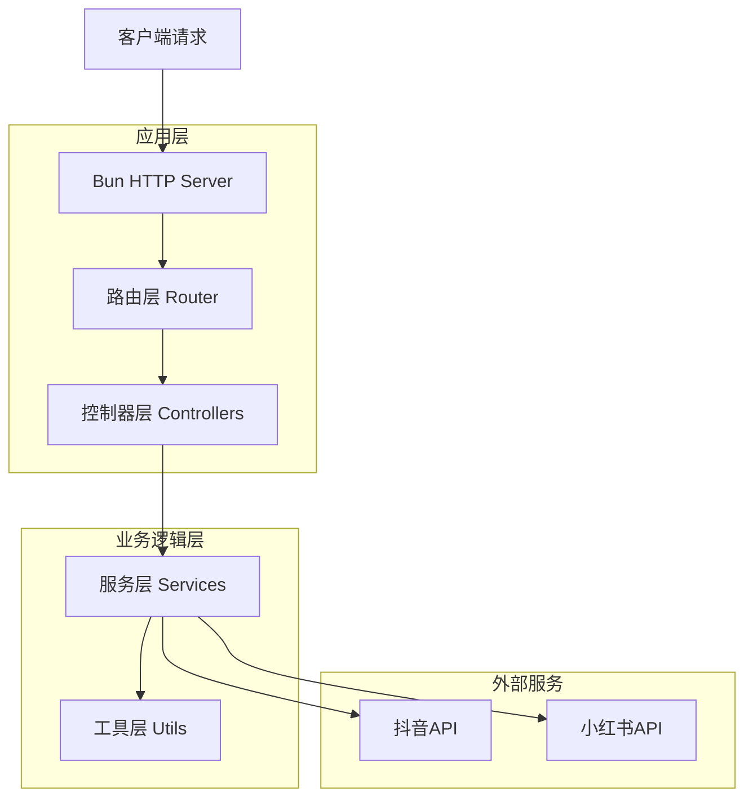
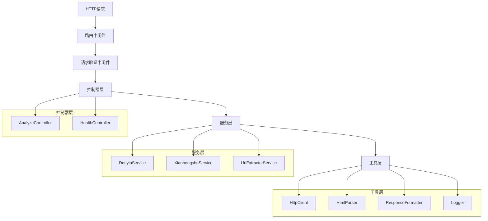
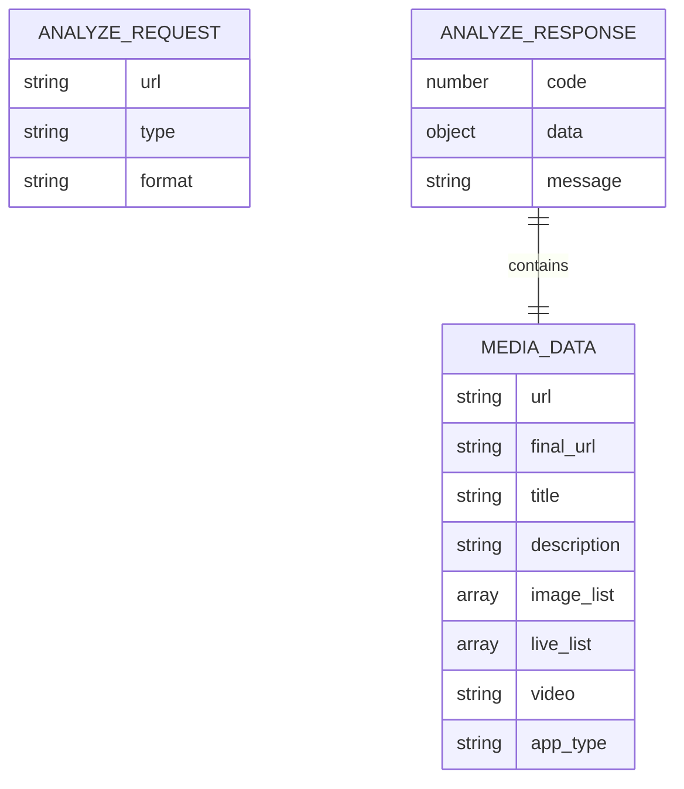

# 视频去水印服务重构 - 技术架构文档

## 1. Architecture design



## 2. Technology Description

* Frontend: 无前端界面（纯API服务）

* Backend: <Bun@1.x> + <TypeScript@5.x> + 内置HTTP服务器

* Testing: Bun内置测试框架

* HTTP Client: 内置fetch API

* HTML解析: <cheerio@1.x>

## 3. Route definitions

| Route                     | Purpose          |
| ------------------------- | ---------------- |
| GET /                     | 根路径，返回服务信息和状态    |
| GET /health               | 健康检查，返回服务运行状态    |
| POST /analyze             | 通用解析接口，自动识别平台并解析 |
| POST /analyze/douyin      | 抖音专用解析接口         |
| POST /analyze/xiaohongshu | 小红书专用解析接口        |

## 4. API definitions

### 4.1 Core API

**通用解析接口**

```
POST /analyze
```

Request:

| Param Name | Param Type | isRequired | Description                     |
| ---------- | ---------- | ---------- | ------------------------------- |
| url        | string     | true       | 包含分享链接的文本内容                     |
| type       | string     | false      | 图片类型，支持 "png" 或 "webp"，默认 "png" |
| format     | string     | false      | 返回格式，支持 "json"，默认 "json"        |

Response:

| Param Name | Param Type | Description     |
| ---------- | ---------- | --------------- |
| code       | number     | 状态码，200成功，500错误 |
| data       | object     | 解析结果数据          |
| message    | string     | 响应消息            |

Example Request:

```json
{
  "url": "3.56 复制打开抖音，看看【央广军事的作品】# 他新创作的九三阅兵BGM再次刷屏 # 请祖国检... G@V.lp eoD:/ 02/08",
  "type": "png",
  "format": "json"
}
```

Example Response:

```json
{
  "code": 200,
  "data": {
    "url": "https://v.douyin.com/eoD",
    "final_url": "https://www.douyin.com/video/7xxx",
    "title": "央广军事的作品",
    "description": "他新创作的九三阅兵BGM再次刷屏",
    "image_list": [],
    "video": "https://aweme.snssdk.com/aweme/v1/play/?video_id=xxx",
    "app_type": "douyin"
  },
  "message": "获取成功"
}
```

**抖音专用接口**

```
POST /analyze/douyin
```

参数和响应格式与通用接口相同。

**小红书专用接口**

```
POST /analyze/xiaohongshu
```

参数和响应格式与通用接口相同，但响应数据中包含额外字段：

Example Response:

```json
{
  "code": 200,
  "data": {
    "url": "https://xhslink.com/35ajO3NDvPp",
    "final_url": "https://www.xiaohongshu.com/explore/xxx",
    "title": "追追米大王的笔记",
    "description": "笔记描述内容",
    "image_list": ["https://ci.xiaohongshu.com/xxx?imageView2/format/png"],
    "live_list": ["https://sns-video-bd.xhscdn.com/xxx"],
    "video": "https://sns-video-bd.xhscdn.com/xxx",
    "app_type": "xiaohongshu"
  },
  "message": "获取成功"
}
```

**健康检查接口**

```
GET /health
```

Response:

```json
{
  "status": "健康",
  "timestamp": "2024-01-01T00:00:00.000Z",
  "environment": "development"
}
```

## 5. Server architecture diagram



## 6. Data model

### 6.1 Data model definition



### 6.2 TypeScript Type Definitions

```typescript
// 请求参数类型
interface AnalyzeRequest {
  url: string;
  type?: 'png' | 'webp';
  format?: 'json';
}

// 响应数据类型
interface ApiResponse<T = any> {
  code: number;
  data: T | null;
  message: string;
}

// 媒体数据类型
interface MediaData {
  url: string;
  final_url: string;
  title: string;
  description: string;
  image_list: string[];
  live_list?: string[]; // 小红书特有
  video: string;
  app_type: 'douyin' | 'xiaohongshu';
}

// 抖音数据结构
interface DouyinVideoData {
  item_list: Array<{
    desc: string;
    images?: Array<{ url_list: string[] }>;
    video?: {
      play_addr: {
        url_list: string[];
      };
    };
  }>;
}

// 小红书数据结构
interface XiaohongshuNoteData {
  note: {
    noteDetailMap: Record<string, {
      note: {
        imageList: Array<{
          urlDefault: string;
          stream?: {
            h264: Array<{ masterUrl: string }>;
          };
        }>;
        video?: {
          media: {
            stream: {
              h264: Array<{ masterUrl: string }>;
            };
          };
        };
      };
    }>;
    firstNoteId: string;
  };
}

// 配置类型
interface AppConfig {
  host: string;
  port: number;
  environment: 'development' | 'production' | 'testing';
  logLevel: 'debug' | 'info' | 'warn' | 'error';
  userAgents: {
    default: string;
    mobile: string;
  };
  appTypeKeywords: {
    xiaohongshu: string[];
    douyin: string[];
  };
}
```

